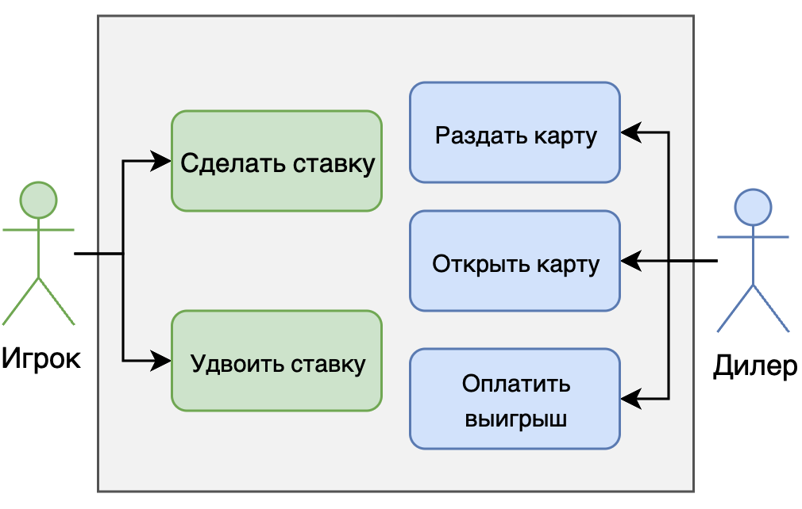

## Диаграмма прецедентов

# Описание прецедентов
### Игрок
| Раздел                               | Описание                                                         |
|--------------------------------------|------------------------------------------------------------------|
| Название                             | Сделать ставку                                                   |
| Описание                             | Игрок делает ставку в размере доступных ему *N* количества фишек |
| Основной исполнитель                 | Игрок                                                            |
| Предусловия                          | Наличия у игрока фишек для минимальной ставки                    |
| Постусловия                          | Размер ставки не должен превышать лимит                          |
| Основной сценарий                    | Игрок ставит фишки, поставленная сумма фиксируется               |

| Раздел                               | Описание                                                                       |
|--------------------------------------|--------------------------------------------------------------------------------|
| Название                             | Удвоить ставку                                                                 |
| Описание                             | Игрок вправе удвоить свою ставку после того, как диллер открыл первые две карты|
| Основной исполнитель                 | Игрок                                                                          |
| Предусловия                          | Между двумя открытыми картами должен быть промежуток больше нуля               |
| Основной сценарий                    | Игрок удваивает ставку, удвоенная сумма фиксируется                            |
| Альтернативные                       | Игрок отказывается от удвоения, сумма ставки остается прежней                  |

### Дилер
| Раздел                               | Описание                                                    |
|--------------------------------------|-------------------------------------------------------------|
| Название                             | Раздать карту                                               |
| Описание                             | Дилер раздает нужное количество карт                        |
| Основной исполнитель                 | Дилер                                                       |
| Предусловия                          | На столе лежит не более двух карт                           |
| Основной сценарий                    | Дилер достает 3 карты, одну из которых кладет рубашкой вверх|

| Раздел                               | Описание                                                              |
|--------------------------------------|-----------------------------------------------------------------------|
| Название                             | Открыть карту                                                         |
| Описание                             | Дилер открывает закрытую карту                                        |
| Основной исполнитель                 | Дилер                                                                 |
| Предусловия                          | Игрок не удвоил / удвоил ставку                                       |
| Основной сценарий                    | После решения игрока дилер переворачивает закрытую карту              |

|       Раздел         |                                           Описание                                                        |
|----------------------|-----------------------------------------------------------------------------------------------------------|
|      Название        | Оплатить выигрыш                                                                                          |
|      Описание        | Дилер выплачивает сумму выигрыша игроку по окончании раунда                                               |
| Основной исполнитель | Дилер                                                                                                     |
|     Предусловия      | Исход раунда оказался успешным для игрока                                                                 |
|  Основной сценарий   | После сыгранного раунда, в случае выигрыша ставки игрока, дилер рассчитывает выигрыш и отдает фишки игроку|