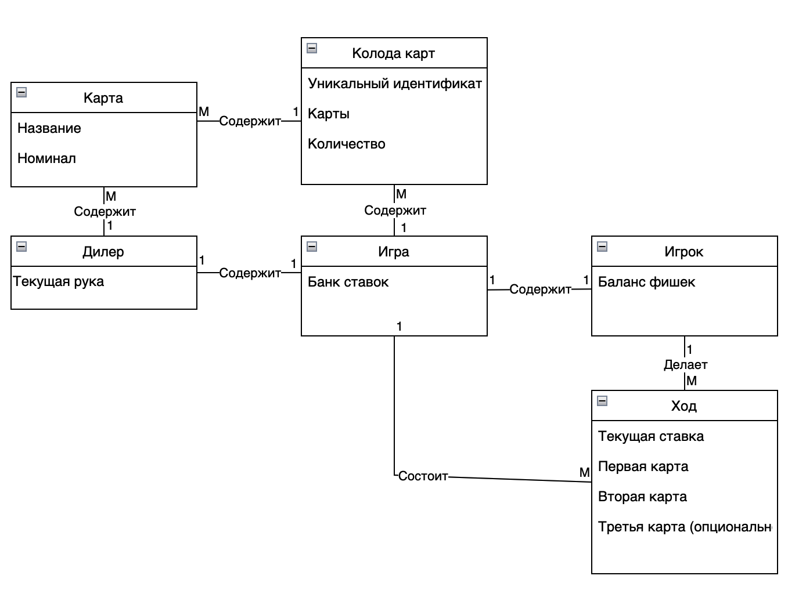

# Модель предметной области

### Сущности и их свойства

| Сущность | Свойство |
|----------|----------|
|    Игрок    | balance: текущий баланс           |
|    Дилер    | current_hand: текущая рука карт   |
|    Игра     | current_bank: текущий банк ставок |
| Колода карт | <table><tr><td>deck_id: идентификатор колоды</td></tr><tr><td>cards: список карт в колоде</td></tr><tr><td>count: количетсво оставшихся карт в колоде</td></tr></table>        |
|    Карта    | <table><tr><td>value: номинал карты</td></tr><tr><td>name: имя карты</td></tr></table>      | 
|     Ход     |   <table><tr><td>first_card: первая выданная игроку карта</td></tr><tr><td>second_card: вторая выданная игроку карта</td></tr><tr><td>third_card: третья выданная игроку карта(опционально)</td></tr><tr><td>player_bet: ставка игрока на текущий раунд</td></tr></table>|

### Связи
1. Игрок делает много ходов (может быть один ход):
    - Один **Player** связан с множеством **Turn**.
    - Один **Turn** связан с одним **Player**.
2. Одна игра состоит из ходов:
    - Один **Game** связан с множеством **Turn**.
    - Один **Turn** связан с одним **Game**.
3. Одна игра содержит много колод (6 колод):
    - Один **Game** связан с множеством **Deck**.
    - Один **Deck** связан с одним **Game**.
4. Одна колода содержит много карт:
    - Один **Deck** связан с множеством **Card**.
    - Один **Card** связан с одним **Deck**.
5. Один дилер содержит много карт:
    - Один **Dealer** связан с множеством **Card** (через **Deck**).
    - Один **Card** связан с одним **Dealer** (через **Deck**).
6. Одна игра - один дилер:
    - Один **Game** связан с одним **Dealer**.
    - Один **Game** может быть связан с множеством **Game** (если **Player** решает продолжить **Game** после окончания раунда).
