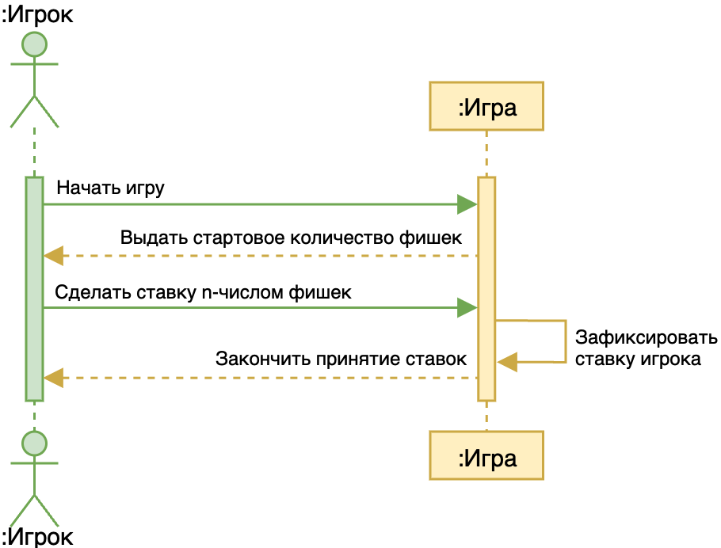
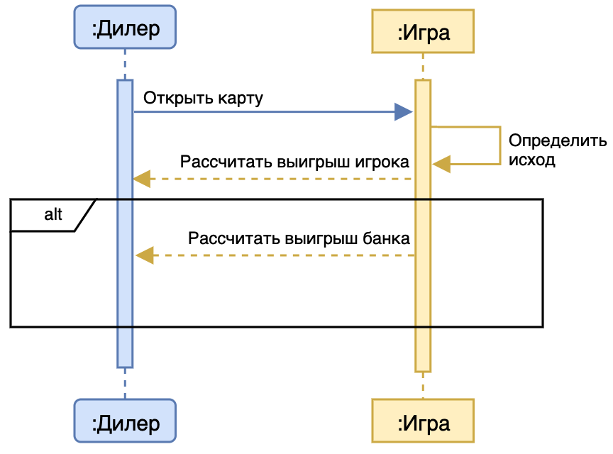

## Сделать ставку

|**Действие**|*Начать игру*|
|------------|---------------|
|**Ссылки**|Начать игру|
|**Предусловия**| |
|**Постусловия**|Игра начата, ожидается выдача фишек игроку|

|**Действие**|*Выдать стартовое количество фишек*|
|------------|-------------------------------------|
|**Ссылки**|Выдать стартовое количество фишек|
|**Предусловия**|Игра начата|
|**Постусловия**|Игрок получил стартовое количество фишек|

|**Действие**|*Cделать ставку n-числом фишек*|
|------------|---------------------------------|
|**Ссылки**|Сделать ставку|
|**Предусловия**|Игрок получил стартовое количество фишек|
|**Постусловия**|Ставка сделана|

|**Действие**|*Закончить принятие ставок*|
|------------|-----------------------------|
|**Ссылки**|Закончить принятие ставок|
|**Предусловия**|Сделана ставка n-числом фишек|
|**Постусловия**|Принятие ставок завершено|

|**Действие**|*Запомнить ставку (self call)*|
|------------|------------------------|
|**Ссылки**|Внутренняя операция игры|
|**Предусловия**|Принятие ставок завершено|
|**Постусловия**|Ставка запомнена игрой|

## Достать карту

| **Действие** | *Достать карту (до двух первых карт)* |
|--------------|-------------------------------------------------------|
| **Ссылки**   | Достать карту                            |
| **Предусловия** | Ставка сделана, требуется раздать первые две карты. |
| **Постусловия** | Карта получена дилером |

| **Действие** | *Получить карту* |
|--------------|---------------------------------|
| **Ссылки**   | Получить карту     |
| **Предусловия** | Карта запрошена дилером |
| **Постусловия** | Карта передана дилеру |

| **Действие** | *Проверить карты (self call)* |
|--------------|---------------------------------------------|
| **Ссылки**   | Внутренняя операция дилера.                 |
| **Предусловия** | Две карты получены. |
| **Постусловия** | Исход на основе первых двух карт определен. |

| **Действие** | *Передать карты* |
|--------------|--------------------------------|
| **Ссылки**  | Передать карты    |
| **Предусловия** | Проверка карт завершена |
| **Постусловия** | Карты переданы игроку |

| **Действие** | *Объявить ничью(alt)* |
|--------------|--------------------------------|
| **Ссылки**   | Объявить ничью    |
| **Предусловия** | Разница между картами 1 очко|
| **Постусловия** | Ничья объявлена |

| **Действие** | *Достать карту (третья карта)* |
|--------------|----------------------------------------------|
| **Ссылки**   | Достать карту                 |
| **Предусловия** | Две карты переданы игроку |
| **Постусловия** | Третья карта получена дилером |

## Удвоить ставку

| **Действие** | *Удвоить ставку* |
|--------------|-------------------------------|
| **Ссылки**   | Удвоить ставку   |
| **Предусловия** | Разданы все три карты |
| **Постусловия** | Решение об удвоении ставки принято |

| **Действие** | *Удвоить ставку игрока (self call)* |
|--------------|-------------------------------------------------|
| **Ссылки**   | Внутренняя операция игры                       |
| **Предусловия** | Игрок выбрал удвоение ставки |
| **Постусловия** | Ставка удвоена |

| **Действие** | *Оставить ставку без изменений (self call)* |
|--------------|---------------------------------------------------------|
| **Ссылки**   | Внутренняя операция игры                               |
| **Предусловия** | Игрок не удвоил ставку |
| **Постусловия** | Ставка остается без изменений |

| **Действие** | *Закончить принятие ставок* |
|--------------|------------------------------------------|
| **Ссылки**   | Закончить принятие ставок   |
| **Предусловия** | Решение об удвоении ставки или оставлении ее без изменений принято |
| **Постусловия** | Принятие ставок завершено |

## Открыть карту

| **Действие** | *Открыть карту (третью)* |
|--------------|----------------------------------------|
| **Ссылки**   | Открыть карту           |
| **Предусловия** | Игрок сделал ставку, две первые карты уже открыты |
| **Постусловия** | Третья карта открыта |

| **Действие** | *Определить исход (self call)* |
|--------------|--------------------------------------------|
| **Ссылки**   | Внутренняя операция игры                 |
| **Предусловия** | Третья карта открыта |
| **Постусловия** | Исход игры определен (выигрыш игрока или банка) |

| **Действие** | *Рассчитать выигрыш игрока* |
|--------------|------------------------------------------|
| **Ссылки**   | Рассчитать выигрыш игрока   |
| **Предусловия** | Исход игры определен, игрок выиграл |
| **Постусловия** | Выигрыш игрока рассчитан |

| **Действие** | *Рассчитать выигрыш банка* |
|--------------|-----------------------------------------|
| **Ссылки**   | Рассчитать выигрыш банка   |
| **Предусловия** | Исход игры определен, банк выиграл |
| **Постусловия** | Выигрыш банка рассчитан |

## Выплатить выигрыш

| **Действие** | *Выплатить выигрыш* |
|--------------|-----------------------------------|
| **Ссылки**   | Выплатить выигрыш   |
| **Предусловия** | Исход игры определен, игрок выиграл |
| **Постусловия** | Выигрыш выплачен игроку |

| **Действие** | *Прибавить фишки к своему банку* |
|--------------|----------------------------|
| **Ссылки**   | Прибавить фишки к банку        |
| **Предусловия** | Выигрыш выплачен |
| **Постусловия** | Выигрыш добавлен к банку игрока |