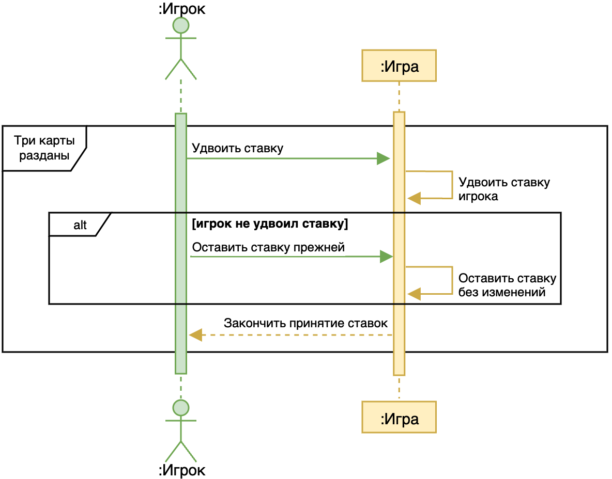
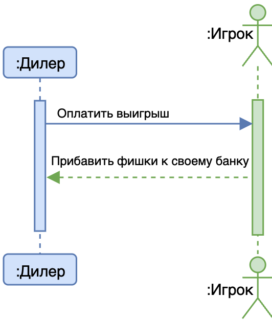

## Сделать ставку

|**Действие**|**Начать игру**|
|Ссылки|Сделать ставку|
|Предусловия|Отсутствует|
|Постусловия|Делать ставку|

|**Действие**|**Делать ставку**|
|Ссылки|Сделать ставку|
|Предусловия|Игра запущена|
|Постусловия|Закончить принятие ставок|

|**Действие**|**Сообщить об ошибке ввода данных**|
|Ссылки|Сделать ставку|
|Предусловия|Недопустимое количество фишек для ставки|
|Постусловия|Появилась информация об ошибке|

## Раздать карту

|**Действие**|**Раздать карту**|
|Ссылки|Открыть карту|
|Предусловия|Ставка сделана|
|Постусловия|Карта раздана|

## Удвоить ставку

|**Действие**|**Запросить удвоение ставки**|
|Ссылки|Подтверждение удвоения ставки|
|Предусловия|Три карты разданы|
|Постусловия| |

|**Действие**|**Подтверждение удвоения ставки**|
|Ссылки|Закончить принятие ставок|
|Предусловия|Запрошено удвоение ставки |
|Постусловия|Получение подтверждения удвоения ставки|

|**Действие**|**Закончить принятие ставок**|
|Ссылки|Подтверждение удвоения ставки|
|Предусловия|Раздана только одна дополнительная карта|
|Постусловия|Принятие ставок завершено|

## Открыть карту

|**Действие**|**Открыть карту**|
|Ссылки|Открыть карту|
|Предусловия|Сделаны все ставки|
|Постусловия|Открыта третья карта|

## Выплатить выигрыш

|**Действие**|**Выплатить выигрыш**|
|Ссылки||
|Предусловия||
|Постусловия|Выигрыш выплачен|

## Рассчитать результат

|**Действие**|**Считает очки игрока**|
|Ссылки||
|Предусловия||
|Постусловия|Очки игрока посчитаны|