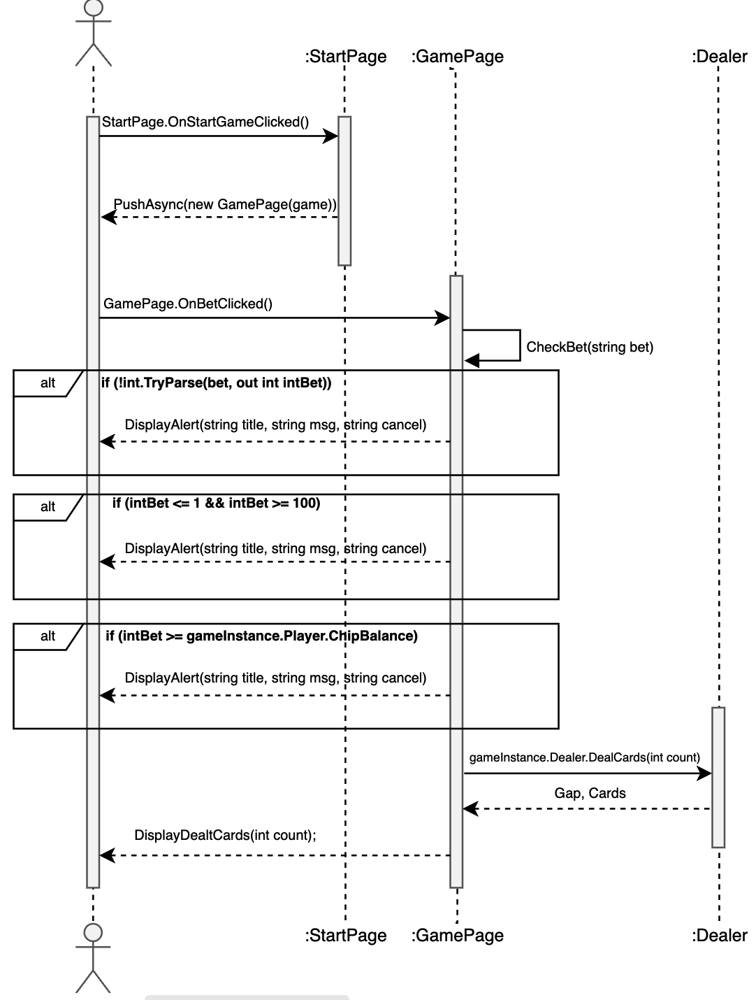

## Сделать ставку

|**Действие**|StartPage.OnStartGameClicked()|
|------------|-------------------------------|
|**Ссылки**|Прецедент - Сделать ставку|
|**Предусловия**|Игра запущена|
|**Постусловия**|Инициализируется новый объект игры и отображается страница игры|

|**Действие**|PushAsync(new GamePage(game))|
|------------|-----------------------------|
|**Ссылки**|Прецедент - Сделать ставку|
|**Предусловия**|Инициализированный объект игры|
|**Постусловия**|Переход на страницу игры с передачей объекта игры|

|**Действие**|GamePage.OnBetClicked()|
|------------|------------------------|
|**Ссылки**|Прецедент - Сделать ставку|
|**Предусловия**|Пользователь ввел ставку|
|**Постусловия**|Обновляется текущая ставка, уменьшается баланс, отображаются две начальные карты|

|**Действие**|DisplayAlert()|
|------------|--------------|
|**Ссылки**|Прецедент - Сделать ставку|
|**Предусловия**|Неверый ввод в поле ставки|
|**Постусловия**|Показывается всплывающее сообщение с кнопкой "ок"|

|**Действие**|gameInstance.Dealer.DealCards(int count)|
|------------|---------------------------------------|
|**Ссылки**|Прецедент - Сделать ставку, достать карты|
|**Предусловия**|Пользователь корректно ввел ставку, инициализированный объект дилера и колоды карт|
|**Постусловия**|Из колоды раздается указанное количество карт, обновляется список карт дилера|

|**Действие**|DisplayDealtCards(int count)|
|------------|-----------------------------|
|**Ссылки**|Прецедент - Сделать ставку, достать карты, удвоить ставку, открыть карту|
|**Предусловия**|Дилер достал карты из колоды, инициализированный список разданных карт|
|**Постусловия**|На экране отображаются карты, соответствующие вытянутым дилером|

## Достать карту

|**Действие**|DealCards(int count)|
|------------|---------------------|
|**Ссылки**|Прецедент - Достать карты|
|**Предусловия**|Инициализированный объект дилера и колоды карт|
|**Постусловия**|Из колоды раздается указанное количество карт, обновляется список карт дилера|

|**Действие**|DisplayDealtCards(int count)|
|------------|-----------------------------|
|**Ссылки**|Прецедент - Достать карты, сделать ставку, удвоить ставку, открыть карту|
|**Предусловия**|Дилер достал карты из колоды, инициализированный список разданных карт|
|**Постусловия**|На экране отображаются карты, соответствующие вытянутым дилером|

|**Действие**|CalculateResult()|
|------------|------------|
|**Ссылки**|Прецедент - Достать карты|
|**Предусловия**|Рассчитать результат|
|**Постусловия**|Расчитывается результат раунда, включая промежуток|

|**Действие**|PayOut()|
|------------|--------|
|**Ссылки**|Прецедент - Достать карты|
|**Предусловия**|Определен результат игры (выигрыш или проигрыш)|
|**Постусловия**|Обновляется баланс игрока в зависимости от результата игры|

|**Действие**|CalculatePayOut()|
|------------|------------------|
|**Ссылки**|Прецедент - Достать карты|
|**Предусловия**|Известны карты, промежуток и текущая ставка|
|**Постусловия**|Рассчитывается выигрыш или проигрыш на основе разданных карт и промежутка|

## Удвоить ставку

|**Действие**|onDoubleBetClicked()|
|------------|---------------------|
|**Ссылки**|Прецедент: Удвоить ставку|
|**Предусловия**|Инициализированный объект страницы игры, ставка сделана, 2 карты разданы и отображены|
|**Постусловия**|Действия передаются с обработчика в функцию DoubleBet()|

|**Действие**|DoubleBet()|
|------------|------------|
|**Ссылки**|Прецедент: Удвоить ставку|
|**Предусловия**|Игрок нажал кнопку удвоения ставки, игра активна|
|**Постусловия**|Ставка игрока удваивается, баланс уменьшается на сумму ставки|

|**Действие**|onRefuseDoubleClicked()|
|------------|-----------------------|
|**Ссылки**|Прецедент: Удвоить ставку|
|**Предусловия**|Игрок нажал кнопку отказа от удвоения ставки, игра активна|
|**Постусловия**|Игрок остается с текущей ставкой, игра продолжается без изменения ставки|

## Открыть карту

## Выплатить выигрыш

