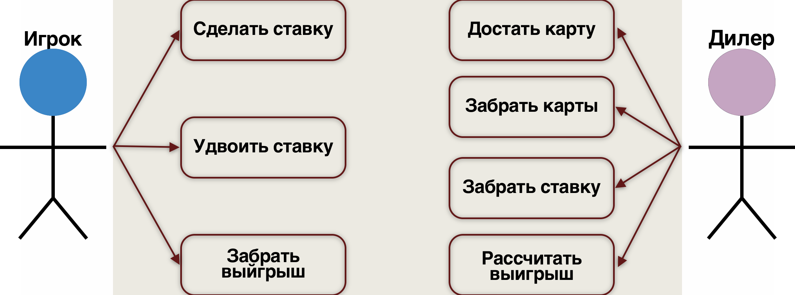

## Диаграмма прецедентов

# Описание прецедентов
### Игрок
| Раздел                               | Описание                                                         |
|--------------------------------------|------------------------------------------------------------------|
| Название                             | Сделать ставку                                                   |
| Описание                             | Игрок делает ставку в размере доступных ему *N* количества фишек |
| Основной исполнитель                 | Игрок                                                            |
| Предусловия                          | Наличия у игрока фишек для минимальной ставки                    |
| Постусловия                          | Размер ставки не должен превышать лимит                          |
| Основной сценарий                    | Игрок ставит фишки, поставленная сумма фиксируется               |

| Раздел                               | Описание                                                                       |
|--------------------------------------|--------------------------------------------------------------------------------|
| Название                             | Удвоить ставку                                                                 |
| Описание                             | Игрок вправе удвоить свою ставку после того, как диллер открыл первые две карты|
| Основной исполнитель                 | Игрок                                                                          |
| Предусловия                          | Между двумя открытыми картами должен быть промежуток больше нуля               |
| Основной сценарий                    | Игрок удваивает ставку, удвоенная сумма фиксируется                            |
| Альтернативные                       | Игрок отказывается от удвоения, сумма ставки остается прежней                  |

| Раздел                               | Описание                                    |
|--------------------------------------|---------------------------------------------|
| Название                             | Забрать выйгрыш                             |
| Описание                             | Игрок может забрать выйгрыш                 |
| Основной исполнитель                 | Игрок                                       |
| Предусловия                          | Исход должен быть победным для игрока       |
| Основной сценарий                    | Игрок забирает выйгрыш                      |
| Альтернативные                       | Игрок сразу ставит выйгрыш на следующую игру|

### Дилер
| Раздел                               | Описание                                                    |
|--------------------------------------|-------------------------------------------------------------|
| Название                             | Достать карту                                               |
| Описание                             | Дилер достает и открывает нужное количество карт            |
| Основной исполнитель                 | Дилер                                                       |
| Предусловия                          | На столе было открыто не более двух карт                    |
| Основной сценарий                    | Дилер достает и кладет на стол карты лицевой стороной наверх|

| Раздел                               | Описание                                                              |
|--------------------------------------|-----------------------------------------------------------------------|
| Название                             | Забрать карты                                                         |
| Рамки                                | Дилер убирает со стола карты по окончании раунда                      |
| Основной исполнитель                 | Дилер                                                                 |
| Предусловия                          | Раунд был сыгран                                                      |
| Основной сценарий                    | Вне зависимости от исхода раунда дилер убирает карты со стола в "бито"|

| Раздел                               | Описание                                                                       |
|--------------------------------------|--------------------------------------------------------------------------------|
| Название                             | Забрать ставку                                                                 |
| Описание                             | Дилер забирает ставку игрока по окончании раунда                               |
| Основной исполнитель                 | Дилер                                                                          |
| Предусловия                          | Исход раунда оказался не успешным для игрока                                   |
| Основной сценарий                    | После сыгранного раунда, в случае проигрыша ставки игрока, дилер забирает фишки|

| Раздел                               | Описание                                                                                                  |
|--------------------------------------|-----------------------------------------------------------------------------------------------------------|
| Название                             | Рассчитать выигрыш                                                                                        |
| Описание                             | Дилер рассчитывает выигрыш игрока по окончании раунда                                                     |
| Основной исполнитель                 | Дилер                                                                                                     |
| Предусловия                          | Исход раунда оказался успешным для игрока                                                                 |
| Основной сценарий                    | После сыгранного раунла, в случае выигрыша ставки игрока, дилер рассчитывает выигрыш и отдает фишки игроку|