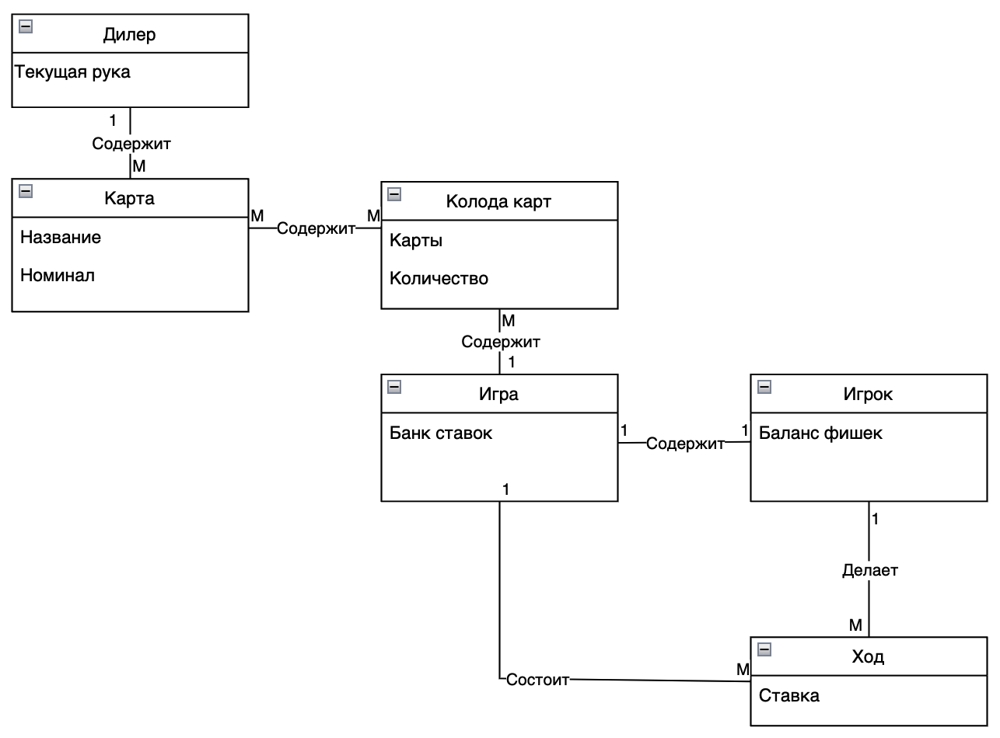

# Модель предметной области

### Отношения между моделями
|                       Отношение                         |
|---------------------------------------------------------|
| Один игрок делает много ходов (может быть один ход)     |
| Одна игра состоит из ходов                              |
| Одна игра содержит много колод (6 колод)                |
| Много колод содержат много карт                         |
| Один дилер содержит много карт                          |